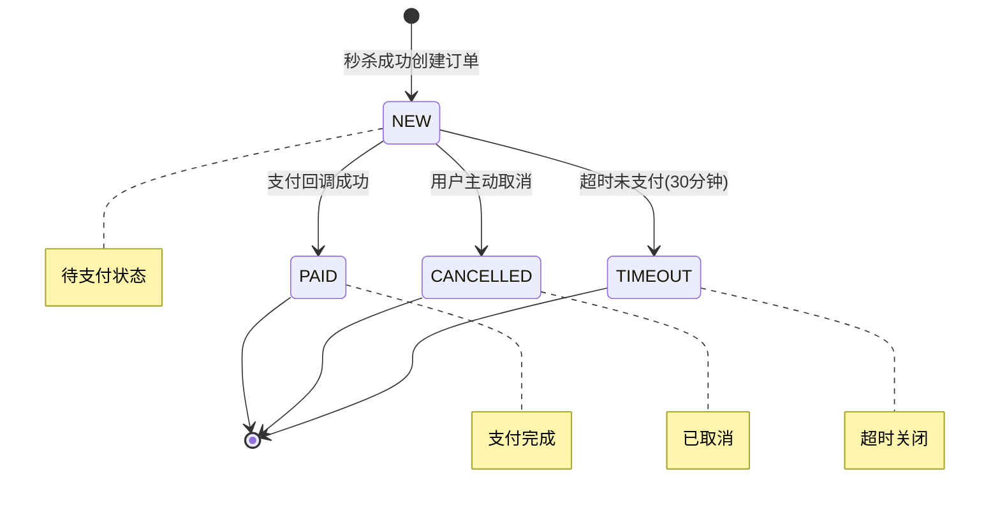

# FlashSaleX 秒杀系统 - PRD & Technical Spec (MVP)

## 【Assumptions】

基于 One-pager 的合理假设，避免阻塞实现：

1. **JWT 有效期**：设为 24 小时，MVP 不实现刷新机制（简化实现，生产环境可后续优化）
2. **订单超时时间**：30 分钟未支付自动变为 TIMEOUT 状态（业务常见做法）
3. **限流维度**：按用户 ID 限流，每用户每秒最多 10 次秒杀请求（防刷单，可配置）
4. **Redis TTL**：幂等键 TTL 1 小时，用户购买标记与活动同生命周期（合理的缓存策略）
5. **金额精度**：使用 DECIMAL(10,2)，支持最大 99,999,999.99（满足一般商品价格需求）
6. **TraceId 格式**：UUID v4 格式，32 位十六进制字符串（标准做法）
7. **初始数据**：提供 SQL 脚本创建默认 ADMIN 用户和示例商品（便于验收测试）

---

## A. Overview

### 背景与目标

**背景**：构建一个高并发秒杀系统，解决电商场景下的库存超卖、重复下单、系统雪崩等核心问题。

**目标**：
- 实现防超卖的秒杀下单流程
- 支持用户限购和请求幂等
- 提供完整的订单状态管理
- 具备基础的限流和可观测性能力
- 可通过 Docker 一键部署和压测验证

**非目标（MVP 不包含）**：
- 消息队列（MQ）集成
- 分布式事务处理
- 微服务架构拆分
- 复杂风控策略
- 真实第三方支付对接

**成功指标**：
- **性能**：单机支持 1000 QPS，P95 响应时间 < 200ms
- **正确性**：库存一致性 100%，无超卖现象
- **可用性**：错误率 < 1%，系统可用性 > 99%
- **幂等性**：重复请求返回一致结果，无重复扣库存

### 角色与权限模型

| 角色 | 权限 | 说明 |
|------|------|------|
| **USER** | 查看商品、参与秒杀、查看订单 | 普通用户，默认角色 |
| **ADMIN** | USER 权限 + 创建秒杀活动 | 管理员，可创建和管理秒杀活动 |

## Environment / Versions (Dev & Run)

- OS: Windows 10/11 (x64)
- JDK: Java 21.0.9 (Temurin 21 LTS)
- Build Tool: Maven Wrapper (mvnw) (Maven 3.9+)
- IDE: Visual Studio Code (latest stable)
- Container Runtime: Docker Desktop (latest stable), Docker Compose v2,
 Version:           29.1.3
 API version:       1.52
 Go version:        go1.25.5

## Runtime Dependencies (via Docker Compose)
- ~~MySQL: 8.0.x~~ **MariaDB: 10.11.x** (替换MySQL解决Windows兼容性问题)
- Redis: 7.2.x (or 7.x)

### TASK2 修复说明
由于MySQL 8.0在Windows Docker Desktop环境下存在架构兼容性问题（"exec format error"），已替换为MariaDB 10.11：
- **兼容性**: MariaDB与MySQL API完全兼容，无需修改应用代码
- **稳定性**: 在Windows Docker环境下更稳定
- **配置优化**: 移除了MySQL 8.0不支持的`NO_AUTO_CREATE_USER`参数


---

## B. Domain & State

### 核心实体与关系

```mermaid
erDiagram
    User ||--o{ Order : creates
    Product ||--o{ SeckillActivity : has
    SeckillActivity ||--o{ Order : generates
    Order ||--o| Payment : has
    
    User {
        bigint id PK
        string email UK
        string password_hash
        enum role
        datetime created_at
    }
    
    Product {
        bigint id PK
        string title
        decimal price
        enum status
        datetime created_at
    }
    
    SeckillActivity {
        bigint id PK
        bigint product_id FK
        datetime start_at
        datetime end_at
        int limit_per_user
        enum status
        datetime created_at
    }
    
    Order {
        bigint id PK
        string order_no UK
        bigint user_id FK
        bigint product_id FK
        bigint activity_id FK
        enum status
        decimal amount
        string idem_key UK
        datetime created_at
        datetime updated_at
    }
    
    Payment {
        bigint id PK
        bigint order_id FK UK
        enum pay_status
        string provider_txn_id UK
        datetime created_at
        datetime updated_at
    }
```

### 订单状态机



**状态流转条件**：
- `NEW → PAID`：收到有效支付回调，且 providerTxnId 未重复
- `NEW → CANCELLED`：用户主动取消（可选实现）
- `NEW → TIMEOUT`：创建时间超过 30 分钟且未支付（定时任务处理）

### 支付回调幂等处理逻辑

**幂等依据**：`providerTxnId`（第三方交易流水号）

**处理流程**：
1. 检查 `payment.provider_txn_id` 是否已存在
2. 若存在：返回 `{ payStatus: "IGNORED" }`，不做任何状态变更
3. 若不存在：
   - 创建 payment 记录
   - 更新 order 状态为 PAID
   - 返回 `{ payStatus: "SUCCESS" }`

**重复回调期望结果**：
- HTTP 200 + `{ payStatus: "IGNORED" }`
- 订单状态保持不变
- 不产生重复的 payment 记录

---

## C. Data Design (MySQL 8)

### 表结构设计

#### 3.1 user 表

```sql
CREATE TABLE `user` (
  `id` BIGINT NOT NULL AUTO_INCREMENT COMMENT '用户ID',
  `email` VARCHAR(255) NOT NULL COMMENT '邮箱',
  `password_hash` VARCHAR(255) NOT NULL COMMENT '密码哈希',
  `role` ENUM('USER', 'ADMIN') NOT NULL DEFAULT 'USER' COMMENT '用户角色',
  `created_at` DATETIME NOT NULL DEFAULT CURRENT_TIMESTAMP COMMENT '创建时间',
  PRIMARY KEY (`id`),
  UNIQUE KEY `uk_email` (`email`)
) ENGINE=InnoDB DEFAULT CHARSET=utf8mb4 COMMENT='用户表';
```

#### 3.2 product 表

```sql
CREATE TABLE `product` (
  `id` BIGINT NOT NULL AUTO_INCREMENT COMMENT '商品ID',
  `title` VARCHAR(255) NOT NULL COMMENT '商品标题',
  `price` DECIMAL(10,2) NOT NULL COMMENT '商品价格',
  `status` ENUM('ON', 'OFF') NOT NULL DEFAULT 'ON' COMMENT '商品状态',
  `created_at` DATETIME NOT NULL DEFAULT CURRENT_TIMESTAMP COMMENT '创建时间',
  PRIMARY KEY (`id`),
  KEY `idx_status` (`status`)
) ENGINE=InnoDB DEFAULT CHARSET=utf8mb4 COMMENT='商品表';
```

#### 3.3 seckill_activity 表

```sql
CREATE TABLE `seckill_activity` (
  `id` BIGINT NOT NULL AUTO_INCREMENT COMMENT '活动ID',
  `product_id` BIGINT NOT NULL COMMENT '商品ID',
  `start_at` DATETIME NOT NULL COMMENT '开始时间',
  `end_at` DATETIME NOT NULL COMMENT '结束时间',
  `limit_per_user` INT NOT NULL DEFAULT 1 COMMENT '每用户限购数量',
  `status` ENUM('PENDING', 'ACTIVE', 'ENDED') NOT NULL DEFAULT 'PENDING' COMMENT '活动状态',
  `created_at` DATETIME NOT NULL DEFAULT CURRENT_TIMESTAMP COMMENT '创建时间',
  PRIMARY KEY (`id`),
  KEY `idx_product_id` (`product_id`),
  KEY `idx_time_range` (`start_at`, `end_at`),
  KEY `idx_status` (`status`)
) ENGINE=InnoDB DEFAULT CHARSET=utf8mb4 COMMENT='秒杀活动表';
```

#### 3.4 order 表

```sql
CREATE TABLE `order` (
  `id` BIGINT NOT NULL AUTO_INCREMENT COMMENT '订单ID',
  `order_no` VARCHAR(32) NOT NULL COMMENT '订单号',
  `user_id` BIGINT NOT NULL COMMENT '用户ID',
  `product_id` BIGINT NOT NULL COMMENT '商品ID',
  `activity_id` BIGINT NULL COMMENT '活动ID',
  `status` ENUM('NEW', 'PAID', 'CANCELLED', 'TIMEOUT') NOT NULL DEFAULT 'NEW' COMMENT '订单状态',
  `amount` DECIMAL(10,2) NOT NULL COMMENT '订单金额',
  `idem_key` VARCHAR(64) NOT NULL COMMENT '幂等键',
  `created_at` DATETIME NOT NULL DEFAULT CURRENT_TIMESTAMP COMMENT '创建时间',
  `updated_at` DATETIME NOT NULL DEFAULT CURRENT_TIMESTAMP ON UPDATE CURRENT_TIMESTAMP COMMENT '更新时间',
  PRIMARY KEY (`id`),
  UNIQUE KEY `uk_order_no` (`order_no`),
  UNIQUE KEY `uk_idem_key` (`idem_key`),
  KEY `idx_user_created` (`user_id`, `created_at`),
  KEY `idx_activity_id` (`activity_id`)
) ENGINE=InnoDB DEFAULT CHARSET=utf8mb4 COMMENT='订单表';
```

#### 3.5 payment 表

```sql
CREATE TABLE `payment` (
  `id` BIGINT NOT NULL AUTO_INCREMENT COMMENT '支付ID',
  `order_id` BIGINT NOT NULL COMMENT '订单ID',
  `pay_status` ENUM('SUCCESS', 'FAILED') NOT NULL COMMENT '支付状态',
  `provider_txn_id` VARCHAR(64) NOT NULL COMMENT '第三方交易流水号',
  `created_at` DATETIME NOT NULL DEFAULT CURRENT_TIMESTAMP COMMENT '创建时间',
  `updated_at` DATETIME NOT NULL DEFAULT CURRENT_TIMESTAMP ON UPDATE CURRENT_TIMESTAMP COMMENT '更新时间',
  PRIMARY KEY (`id`),
  UNIQUE KEY `uk_order_id` (`order_id`),
  UNIQUE KEY `uk_provider_txn_id` (`provider_txn_id`)
) ENGINE=InnoDB DEFAULT CHARSET=utf8mb4 COMMENT='支付表';
```

### 幂等冲突处理策略

| 约束冲突 | HTTP 状态码 | 业务错误码 | 处理策略 |
|----------|-------------|------------|----------|
| `order.idem_key` 重复 | 200 | SUCCESS | 返回已存在的 orderNo |
| `payment.provider_txn_id` 重复 | 200 | SUCCESS | 返回 `payStatus: "IGNORED"` |
| `user.email` 重复 | 409 | EMAIL_ALREADY_EXISTS | 提示邮箱已注册 |

### 初始化数据 SQL

```sql
-- 创建默认管理员用户
INSERT INTO `user` (`email`, `password_hash`, `role`) VALUES 
('admin@flashsalex.com', '$2a$10$N.zmdr9k7uOCQb376NoUnuTJ8iKXIGkjJNdRjS6jKpOKOmyuXWpJG', 'ADMIN');
-- 密码: admin123

-- 创建示例商品
INSERT INTO `product` (`title`, `price`, `status`) VALUES 
('iPhone 15 Pro', 7999.00, 'ON'),
('MacBook Pro M3', 12999.00, 'ON'),
('AirPods Pro', 1999.00, 'ON');
```

---

## D. Redis Design & Lua

### Redis Key 设计

| Key 模式 | Value 类型 | TTL | 说明 |
|----------|------------|-----|------|
| `activity_stock:{activityId}` | String (Integer) | 活动结束后 1 小时 | 活动剩余库存 |
| `activity_user_bought:{activityId}:{userId}` | String ("1") | 活动结束后 1 小时 | 用户购买标记 |
| `idem:{userId}:{idempotencyKey}` | String (orderNo) | 1 小时 | 幂等结果缓存 |
| `rate_limit:{userId}` | String (count) | 1 秒 | 用户限流计数器 |

### Lua 脚本设计

#### 秒杀购买核心脚本

```lua
-- seckill_purchase.lua
-- KEYS[1]: activity_stock:{activityId}
-- KEYS[2]: activity_user_bought:{activityId}:{userId}  
-- KEYS[3]: idem:{userId}:{idempotencyKey}
-- ARGV[1]: activityId
-- ARGV[2]: userId
-- ARGV[3]: idempotencyKey
-- ARGV[4]: orderNo
-- ARGV[5]: startAt (timestamp)
-- ARGV[6]: endAt (timestamp)
-- ARGV[7]: limitPerUser
-- ARGV[8]: currentTime (timestamp)

local activityId = ARGV[1]
local userId = ARGV[2]
local idempotencyKey = ARGV[3]
local orderNo = ARGV[4]
local startAt = tonumber(ARGV[5])
local endAt = tonumber(ARGV[6])
local limitPerUser = tonumber(ARGV[7])
local currentTime = tonumber(ARGV[8])

-- 返回码定义
local SUCCESS = 0
local ACTIVITY_NOT_STARTED = 1001
local ACTIVITY_ENDED = 1002
local SOLD_OUT = 1003
local REACH_LIMIT = 1004
local DUPLICATE_REQUEST = 1005

-- 1. 检查幂等
local existingOrder = redis.call('GET', KEYS[3])
if existingOrder then
    return {DUPLICATE_REQUEST, existingOrder}
end

-- 2. 检查活动时间
if currentTime < startAt then
    return {ACTIVITY_NOT_STARTED, ""}
end

if currentTime > endAt then
    return {ACTIVITY_ENDED, ""}
end

-- 3. 检查库存
local stock = redis.call('GET', KEYS[1])
if not stock or tonumber(stock) <= 0 then
    return {SOLD_OUT, ""}
end

-- 4. 检查限购
local userBought = redis.call('GET', KEYS[2])
if userBought and tonumber(userBought) >= limitPerUser then
    return {REACH_LIMIT, ""}
end

-- 5. 原子扣减库存和标记购买
redis.call('DECR', KEYS[1])
redis.call('INCR', KEYS[2])
redis.call('SETEX', KEYS[3], 3600, orderNo)

-- 6. 设置 TTL（如果是首次设置）
local stockTtl = redis.call('TTL', KEYS[1])
if stockTtl == -1 then
    redis.call('EXPIRE', KEYS[1], 3600)
end

local userBoughtTtl = redis.call('TTL', KEYS[2])
if userBoughtTtl == -1 then
    redis.call('EXPIRE', KEYS[2], 3600)
end

return {SUCCESS, orderNo}
```

#### 限流检查脚本

```lua
-- rate_limit.lua
-- KEYS[1]: rate_limit:{userId}
-- ARGV[1]: limit (每秒最大请求数)
-- ARGV[2]: window (时间窗口，秒)

local current = redis.call('GET', KEYS[1])
if current == false then
    redis.call('SETEX', KEYS[1], ARGV[2], 1)
    return 1
end

if tonumber(current) < tonumber(ARGV[1]) then
    return redis.call('INCR', KEYS[1])
else
    return -1
end
```

### 补偿策略

**场景**：Redis 预扣成功但 DB 落单失败

**补偿逻辑**：
1. 捕获 DB 异常，记录错误日志（包含 traceId、activityId、userId、idempotencyKey）
2. 执行补偿 Lua 脚本，回滚 Redis 状态：
   - 库存 +1：`INCR activity_stock:{activityId}`
   - 删除购买标记：`DEL activity_user_bought:{activityId}:{userId}`
   - 删除幂等键：`DEL idem:{userId}:{idempotencyKey}`
3. 返回 INTERNAL_ERROR 给用户

**补偿脚本**：
```lua
-- compensate.lua
-- KEYS[1]: activity_stock:{activityId}
-- KEYS[2]: activity_user_bought:{activityId}:{userId}
-- KEYS[3]: idem:{userId}:{idempotencyKey}

redis.call('INCR', KEYS[1])
redis.call('DECR', KEYS[2])
redis.call('DEL', KEYS[3])
return 1
```

---

## E. API Contract

### 统一响应格式

```json
{
  "code": "SUCCESS",
  "message": "操作成功",
  "data": {},
  "traceId": "a1b2c3d4-e5f6-7890-abcd-ef1234567890"
}
```

### E.1 认证接口

#### POST /api/auth/register

**Auth**: 无需认证

**Request**:
```json
{
  "email": "user@example.com",
  "password": "password123"
}
```

**Response**:
- **成功 (200)**:
```json
{
  "code": "SUCCESS",
  "message": "注册成功",
  "data": {
    "userId": 12345
  },
  "traceId": "a1b2c3d4-e5f6-7890-abcd-ef1234567890"
}
```

- **邮箱已存在 (409)**:
```json
{
  "code": "EMAIL_ALREADY_EXISTS",
  "message": "邮箱已被注册",
  "data": null,
  "traceId": "a1b2c3d4-e5f6-7890-abcd-ef1234567890"
}
```

- **参数错误 (400)**:
```json
{
  "code": "INVALID_PARAMS",
  "message": "邮箱格式不正确",
  "data": null,
  "traceId": "a1b2c3d4-e5f6-7890-abcd-ef1234567890"
}
```

**幂等行为**: 相同邮箱重复注册返回 409 错误

#### POST /api/auth/login

**Auth**: 无需认证

**Request**:
```json
{
  "email": "user@example.com",
  "password": "password123"
}
```

**Response**:
- **成功 (200)**:
```json
{
  "code": "SUCCESS",
  "message": "登录成功",
  "data": {
    "token": "eyJhbGciOiJIUzI1NiIsInR5cCI6IkpXVCJ9...",
    "expiresIn": 86400
  },
  "traceId": "a1b2c3d4-e5f6-7890-abcd-ef1234567890"
}
```

- **认证失败 (401)**:
```json
{
  "code": "AUTH_INVALID_CREDENTIALS",
  "message": "邮箱或密码错误",
  "data": null,
  "traceId": "a1b2c3d4-e5f6-7890-abcd-ef1234567890"
}
```

### E.2 商品接口

#### GET /api/products

**Auth**: 无需认证

**Response**:
```json
{
  "code": "SUCCESS",
  "message": "查询成功",
  "data": [
    {
      "id": 1,
      "title": "iPhone 15 Pro",
      "price": 7999.00,
      "status": "ON"
    }
  ],
  "traceId": "a1b2c3d4-e5f6-7890-abcd-ef1234567890"
}
```

#### GET /api/products/{id}

**Auth**: 无需认证

**Response**:
- **成功 (200)**: 同上单个商品对象
- **不存在 (404)**:
```json
{
  "code": "NOT_FOUND",
  "message": "商品不存在",
  "data": null,
  "traceId": "a1b2c3d4-e5f6-7890-abcd-ef1234567890"
}
```

### E.3 秒杀活动接口

#### POST /api/admin/activities

**Auth**: 需要 JWT，且角色为 ADMIN

**Headers**:
```
Authorization: Bearer <jwt_token>
Content-Type: application/json
```

**Request**:
```json
{
  "productId": 1,
  "startAt": "2024-01-01T10:00:00",
  "endAt": "2024-01-01T12:00:00",
  "limitPerUser": 1,
  "initialStock": 100
}
```

**Response**:
- **成功 (200)**:
```json
{
  "code": "SUCCESS",
  "message": "活动创建成功",
  "data": {
    "activityId": 1001
  },
  "traceId": "a1b2c3d4-e5f6-7890-abcd-ef1234567890"
}
```

- **权限不足 (403)**:
```json
{
  "code": "FORBIDDEN",
  "message": "需要管理员权限",
  "data": null,
  "traceId": "a1b2c3d4-e5f6-7890-abcd-ef1234567890"
}
```

#### GET /api/activities/{activityId}

**Auth**: 无需认证

**Response**:
```json
{
  "code": "SUCCESS",
  "message": "查询成功",
  "data": {
    "activityId": 1001,
    "productId": 1,
    "startAt": "2024-01-01T10:00:00",
    "endAt": "2024-01-01T12:00:00",
    "limitPerUser": 1,
    "status": "ACTIVE",
    "stockLeft": 85
  },
  "traceId": "a1b2c3d4-e5f6-7890-abcd-ef1234567890"
}
```

### E.4 秒杀购买接口

#### POST /api/seckill/{activityId}/purchase

**Auth**: 需要 JWT

**Headers**:
```
Authorization: Bearer <jwt_token>
Idempotency-Key: <uuid>
Content-Type: application/json
```

**Request**: 空 body `{}`

**Response**:
- **成功 (200)**:
```json
{
  "code": "SUCCESS",
  "message": "购买成功",
  "data": {
    "orderNo": "ORD20240101001",
    "orderStatus": "NEW"
  },
  "traceId": "a1b2c3d4-e5f6-7890-abcd-ef1234567890"
}
```

- **活动未开始 (400)**:
```json
{
  "code": "ACTIVITY_NOT_STARTED",
  "message": "活动尚未开始",
  "data": null,
  "traceId": "a1b2c3d4-e5f6-7890-abcd-ef1234567890"
}
```

- **已售罄 (400)**:
```json
{
  "code": "SOLD_OUT",
  "message": "商品已售罄",
  "data": null,
  "traceId": "a1b2c3d4-e5f6-7890-abcd-ef1234567890"
}
```

- **达到限购 (400)**:
```json
{
  "code": "REACH_LIMIT",
  "message": "已达到限购数量",
  "data": null,
  "traceId": "a1b2c3d4-e5f6-7890-abcd-ef1234567890"
}
```

- **重复请求 (200)**:
```json
{
  "code": "SUCCESS",
  "message": "购买成功",
  "data": {
    "orderNo": "ORD20240101001",
    "orderStatus": "NEW"
  },
  "traceId": "a1b2c3d4-e5f6-7890-abcd-ef1234567890"
}
```

- **限流 (429)**:
```json
{
  "code": "RATE_LIMITED",
  "message": "请求过于频繁，请稍后重试",
  "data": null,
  "traceId": "a1b2c3d4-e5f6-7890-abcd-ef1234567890"
}
```

**幂等行为**: 相同 userId + Idempotency-Key 返回同一 orderNo，不重复扣库存

**边界条件**:
- 活动时间窗口：严格按 startAt/endAt 判断
- 并发购买：Lua 脚本保证原子性，先到先得
- 库存为 0：立即返回 SOLD_OUT
- 用户已购买：立即返回 REACH_LIMIT

### E.5 订单接口

#### GET /api/orders/{orderNo}

**Auth**: 需要 JWT，且只能查询自己的订单

**Response**:
```json
{
  "code": "SUCCESS",
  "message": "查询成功",
  "data": {
    "orderNo": "ORD20240101001",
    "userId": 12345,
    "productId": 1,
    "activityId": 1001,
    "status": "NEW",
    "amount": 7999.00,
    "createdAt": "2024-01-01T10:30:00"
  },
  "traceId": "a1b2c3d4-e5f6-7890-abcd-ef1234567890"
}
```

### E.6 支付回调接口

#### POST /api/payments/mock-callback

**Auth**: 无需认证（模拟第三方回调）

**Request**:
```json
{
  "orderNo": "ORD20240101001",
  "providerTxnId": "PAY20240101001",
  "paidAt": "2024-01-01T10:35:00"
}
```

**Response**:
- **首次回调成功 (200)**:
```json
{
  "code": "SUCCESS",
  "message": "支付处理成功",
  "data": {
    "payStatus": "SUCCESS"
  },
  "traceId": "a1b2c3d4-e5f6-7890-abcd-ef1234567890"
}
```

- **重复回调 (200)**:
```json
{
  "code": "SUCCESS",
  "message": "重复回调已忽略",
  "data": {
    "payStatus": "IGNORED"
  },
  "traceId": "a1b2c3d4-e5f6-7890-abcd-ef1234567890"
}
```

**幂等行为**: 相同 providerTxnId 重复回调返回 IGNORED，不重复更新订单状态

---

## F. Non-Functional Requirements

### 性能与容量目标

| 指标 | 目标值 | 测试方法 |
|------|--------|----------|
| **QPS** | 1000 | k6 压测秒杀接口 |
| **P95 响应时间** | < 200ms | k6 统计 |
| **P99 响应时间** | < 500ms | k6 统计 |
| **错误率** | < 1% | 压测期间错误请求比例 |
| **库存一致性** | 100% | 压测后验证 Redis 库存 = DB 订单数 |

### 限流策略

**算法**: 令牌桶（基于 Redis）
**维度**: 按用户 ID
**配置**: 每用户每秒最多 10 次秒杀请求
**实现**: 
- 使用 Redis 计数器 + TTL
- 超限返回 HTTP 429 + RATE_LIMITED 错误码
- 限流仅针对 `/api/seckill/*` 路径

### 安全策略

**密码存储**: BCrypt 加密，强度 10
**JWT 配置**:
- 有效期: 24 小时
- 签名算法: HS256
- 密钥: 配置文件指定，生产环境使用环境变量
- 刷新策略: MVP 不实现自动刷新

**输入验证**:
- 邮箱格式校验
- 密码长度 6-20 位
- 金额精度校验（最多 2 位小数）

### 可观测性

**TraceId**:
- 格式: UUID v4（32 位十六进制）
- 生成: 每个请求入口生成或从 Header 获取
- 透传: 写入 MDC，所有日志自动包含
- 响应: 通过 `X-Trace-Id` Header 返回

**关键日志埋点**:
```java
// 秒杀请求入口
log.info("Seckill request: activityId={}, userId={}, idempotencyKey={}", 
         activityId, userId, idempotencyKey);

// Lua 脚本执行结果
log.info("Lua script result: code={}, orderNo={}, activityId={}, userId={}", 
         luaResult.getCode(), luaResult.getOrderNo(), activityId, userId);

// 订单创建结果
log.info("Order created: orderNo={}, userId={}, amount={}, activityId={}", 
         orderNo, userId, amount, activityId);

// 支付回调处理
log.info("Payment callback: orderNo={}, providerTxnId={}, payStatus={}", 
         orderNo, providerTxnId, payStatus);

// 幂等命中情况
log.info("Idempotent request: userId={}, idempotencyKey={}, existingOrderNo={}", 
         userId, idempotencyKey, existingOrderNo);
```

**日志格式**:
```
[2024-01-01 10:30:00.123] [INFO] [traceId:a1b2c3d4-e5f6-7890-abcd-ef1234567890] [thread:http-nio-8080-exec-1] [class:SeckillController] - Seckill request: activityId=1001, userId=12345, idempotencyKey=uuid-123
```

### 配置管理

**application.yml 关键配置**:
```yaml
spring:
  datasource:
    url: jdbc:mysql://localhost:3306/flashsalex?useUnicode=true&characterEncoding=utf8&useSSL=false&serverTimezone=Asia/Shanghai
    username: ${DB_USERNAME:root}
    password: ${DB_PASSWORD:password}
  
  redis:
    host: ${REDIS_HOST:localhost}
    port: ${REDIS_PORT:6379}
    password: ${REDIS_PASSWORD:}
    database: 0

app:
  jwt:
    secret: ${JWT_SECRET:your-secret-key-here}
    expiration: ${JWT_EXPIRATION:86400}
  
  rate-limit:
    seckill-per-user-per-second: ${RATE_LIMIT_SECKILL:10}
  
  order:
    timeout-minutes: ${ORDER_TIMEOUT:30}
```

**环境变量清单**:
- `DB_USERNAME`: 数据库用户名
- `DB_PASSWORD`: 数据库密码  
- `REDIS_HOST`: Redis 主机地址
- `REDIS_PORT`: Redis 端口
- `REDIS_PASSWORD`: Redis 密码
- `JWT_SECRET`: JWT 签名密钥
- `JWT_EXPIRATION`: JWT 有效期（秒）
- `RATE_LIMIT_SECKILL`: 秒杀限流阈值
- `ORDER_TIMEOUT`: 订单超时时间（分钟）

### 失败策略

**超时处理**:
- HTTP 请求超时: 30 秒
- 数据库连接超时: 5 秒
- Redis 操作超时: 3 秒

**重试策略**:
- 数据库操作: 不重试（避免重复扣库存）
- Redis 操作: 最多重试 2 次，间隔 100ms
- 外部 API: 不适用（MVP 无外部依赖）

**幂等冲突处理**:
- `order.idem_key` 冲突: 查询已存在订单，返回相同结果
- `payment.provider_txn_id` 冲突: 返回 `payStatus: "IGNORED"`
- 数据库唯一键冲突: 捕获异常，返回对应业务错误码

**补偿机制**:
- Redis 预扣成功但 DB 落单失败: 执行补偿 Lua 脚本回滚 Redis 状态
- 补偿失败: 记录错误日志，人工介入处理

---

## G. Testing & Acceptance

### 单元测试清单

#### G.1 认证模块测试

**测试用例**: `AuthServiceTest.testRegisterSuccess`
- **前置条件**: 数据库为空
- **步骤**: 调用 register("test@example.com", "password123")
- **预期结果**: 返回 userId，数据库中存在对应用户记录，密码已加密

**测试用例**: `AuthServiceTest.testRegisterDuplicateEmail`
- **前置条件**: 数据库中已存在 test@example.com 用户
- **步骤**: 再次调用 register("test@example.com", "password456")
- **预期结果**: 抛出 EmailAlreadyExistsException

**测试用例**: `AuthServiceTest.testLoginSuccess`
- **前置条件**: 数据库中存在用户 test@example.com
- **步骤**: 调用 login("test@example.com", "correct_password")
- **预期结果**: 返回有效 JWT token

**测试用例**: `AuthServiceTest.testLoginInvalidCredentials`
- **前置条件**: 数据库中存在用户 test@example.com
- **步骤**: 调用 login("test@example.com", "wrong_password")
- **预期结果**: 抛出 InvalidCredentialsException

#### G.2 秒杀模块测试

**测试用例**: `SeckillServiceTest.testPurchaseSuccess`
- **前置条件**: 活动进行中，库存 > 0，用户未购买
- **步骤**: 调用 purchase(activityId, userId, idempotencyKey)
- **预期结果**: 返回 orderNo，Redis 库存 -1，用户购买标记设置

**测试用例**: `SeckillServiceTest.testPurchaseActivityNotStarted`
- **前置条件**: 活动未开始（当前时间 < startAt）
- **步骤**: 调用 purchase(activityId, userId, idempotencyKey)
- **预期结果**: 返回 ACTIVITY_NOT_STARTED 错误码

**测试用例**: `SeckillServiceTest.testPurchaseActivityEnded`
- **前置条件**: 活动已结束（当前时间 > endAt）
- **步骤**: 调用 purchase(activityId, userId, idempotencyKey)
- **预期结果**: 返回 ACTIVITY_ENDED 错误码

**测试用例**: `SeckillServiceTest.testPurchaseSoldOut`
- **前置条件**: 活动进行中，库存 = 0
- **步骤**: 调用 purchase(activityId, userId, idempotencyKey)
- **预期结果**: 返回 SOLD_OUT 错误码

**测试用例**: `SeckillServiceTest.testPurchaseReachLimit`
- **前置条件**: 活动进行中，用户已购买达到限购数量
- **步骤**: 调用 purchase(activityId, userId, idempotencyKey)
- **预期结果**: 返回 REACH_LIMIT 错误码

**测试用例**: `SeckillServiceTest.testPurchaseIdempotent`
- **前置条件**: 用户已成功购买过，使用相同 idempotencyKey
- **步骤**: 再次调用 purchase(activityId, userId, idempotencyKey)
- **预期结果**: 返回相同 orderNo，Redis 状态不变

#### G.3 支付回调测试

**测试用例**: `PaymentServiceTest.testCallbackSuccess`
- **前置条件**: 订单状态为 NEW，providerTxnId 未重复
- **步骤**: 调用 processCallback(orderNo, providerTxnId, paidAt)
- **预期结果**: 订单状态变为 PAID，创建 payment 记录

**测试用例**: `PaymentServiceTest.testCallbackIdempotent`
- **前置条件**: 相同 providerTxnId 已处理过
- **步骤**: 再次调用 processCallback(orderNo, providerTxnId, paidAt)
- **预期结果**: 返回 payStatus: "IGNORED"，订单状态不变

### 集成测试

**测试用例**: `SeckillIntegrationTest.testFullSeckillFlow`
- **前置条件**: Docker 环境启动，数据库和 Redis 可用
- **步骤**:
  1. 注册用户并登录获取 token
  2. 创建商品和秒杀活动
  3. 发起秒杀购买请求
  4. 查询订单状态
  5. 调用支付回调
  6. 再次查询订单状态
- **预期结果**: 
  - 秒杀成功返回 orderNo
  - 订单状态从 NEW 变为 PAID
  - Redis 库存正确扣减
  - 所有响应包含 traceId

**测试用例**: `SeckillConcurrencyTest.testConcurrentPurchase`
- **前置条件**: 活动库存为 10
- **步骤**: 并发发起 20 个购买请求（不同用户）
- **预期结果**: 
  - 只有 10 个请求成功
  - 10 个请求返回 SOLD_OUT
  - Redis 库存为 0
  - 数据库订单数量为 10

### 验收测试流程

#### 环境准备

```bash
# 1. 启动基础服务
docker compose up -d

# 2. 等待服务就绪
sleep 10

# 3. 运行测试
./mvnw test

# 4. 启动应用
./mvnw spring-boot:run
```

#### 手动验收脚本

```bash
#!/bin/bash

BASE_URL="http://localhost:8080"
ADMIN_TOKEN=""
USER_TOKEN=""

# 1. 注册管理员用户
echo "=== 注册管理员用户 ==="
curl -X POST $BASE_URL/api/auth/register \
  -H "Content-Type: application/json" \
  -d '{"email":"admin@test.com","password":"admin123"}'

# 2. 管理员登录
echo "=== 管理员登录 ==="
ADMIN_RESPONSE=$(curl -s -X POST $BASE_URL/api/auth/login \
  -H "Content-Type: application/json" \
  -d '{"email":"admin@test.com","password":"admin123"}')
ADMIN_TOKEN=$(echo $ADMIN_RESPONSE | jq -r '.data.token')

# 3. 创建秒杀活动
echo "=== 创建秒杀活动 ==="
ACTIVITY_RESPONSE=$(curl -s -X POST $BASE_URL/api/admin/activities \
  -H "Authorization: Bearer $ADMIN_TOKEN" \
  -H "Content-Type: application/json" \
  -d '{
    "productId": 1,
    "startAt": "2024-01-01T00:00:00",
    "endAt": "2024-12-31T23:59:59",
    "limitPerUser": 1,
    "initialStock": 100
  }')
ACTIVITY_ID=$(echo $ACTIVITY_RESPONSE | jq -r '.data.activityId')

# 4. 注册普通用户
echo "=== 注册普通用户 ==="
curl -X POST $BASE_URL/api/auth/register \
  -H "Content-Type: application/json" \
  -d '{"email":"user@test.com","password":"user123"}'

# 5. 普通用户登录
echo "=== 普通用户登录 ==="
USER_RESPONSE=$(curl -s -X POST $BASE_URL/api/auth/login \
  -H "Content-Type: application/json" \
  -d '{"email":"user@test.com","password":"user123"}')
USER_TOKEN=$(echo $USER_RESPONSE | jq -r '.data.token')

# 6. 参与秒杀
echo "=== 参与秒杀 ==="
PURCHASE_RESPONSE=$(curl -s -X POST $BASE_URL/api/seckill/$ACTIVITY_ID/purchase \
  -H "Authorization: Bearer $USER_TOKEN" \
  -H "Idempotency-Key: $(uuidgen)" \
  -H "Content-Type: application/json" \
  -d '{}')
ORDER_NO=$(echo $PURCHASE_RESPONSE | jq -r '.data.orderNo')

# 7. 查询订单
echo "=== 查询订单 ==="
curl -s -X GET $BASE_URL/api/orders/$ORDER_NO \
  -H "Authorization: Bearer $USER_TOKEN"

# 8. 支付回调
echo "=== 支付回调 ==="
curl -s -X POST $BASE_URL/api/payments/mock-callback \
  -H "Content-Type: application/json" \
  -d '{
    "orderNo": "'$ORDER_NO'",
    "providerTxnId": "PAY'$(date +%s)'",
    "paidAt": "'$(date -u +%Y-%m-%dT%H:%M:%S)'"
  }'

# 9. 再次查询订单状态
echo "=== 查询订单状态（应为PAID） ==="
curl -s -X GET $BASE_URL/api/orders/$ORDER_NO \
  -H "Authorization: Bearer $USER_TOKEN"

# 10. 测试幂等性
echo "=== 测试重复购买（应返回相同结果） ==="
curl -s -X POST $BASE_URL/api/seckill/$ACTIVITY_ID/purchase \
  -H "Authorization: Bearer $USER_TOKEN" \
  -H "Idempotency-Key: test-idempotent-key" \
  -H "Content-Type: application/json" \
  -d '{}'

curl -s -X POST $BASE_URL/api/seckill/$ACTIVITY_ID/purchase \
  -H "Authorization: Bearer $USER_TOKEN" \
  -H "Idempotency-Key: test-idempotent-key" \
  -H "Content-Type: application/json" \
  -d '{}'

echo "=== 验收测试完成 ==="
```

### K6 压测脚本结构

```javascript
// k6-seckill-test.js
import http from 'k6/http';
import { check } from 'k6';

export let options = {
  stages: [
    { duration: '30s', target: 100 },  // 30秒内增加到100用户
    { duration: '1m', target: 500 },   // 1分钟内增加到500用户
    { duration: '2m', target: 1000 },  // 2分钟内增加到1000用户
    { duration: '30s', target: 0 },    // 30秒内降到0用户
  ],
  thresholds: {
    http_req_duration: ['p(95)<200'],  // P95 < 200ms
    http_req_failed: ['rate<0.01'],    // 错误率 < 1%
  },
};

export function setup() {
  // 创建测试用户和活动
  // 返回 { activityId, tokens: [...] }
}

export default function(data) {
  // 随机选择用户token
  // 发起秒杀请求
  // 检查响应状态和业务错误码
}

export function teardown(data) {
  // 验证库存一致性
  // 输出测试报告
}
```

**断言要求**:
- P95 响应时间 < 200ms
- 错误率 < 1%
- 库存一致性: Redis 剩余库存 + DB 成功订单数 = 初始库存

---

## H. Delivery Plan

### 开发任务拆分（15 个任务）

#### Phase 1: 基础框架搭建

**Task 1: 项目初始化与基础配置**
- **目标**: 创建 Spring Boot 3 项目，配置 Maven 依赖
- **涉及模块**: 项目根目录，配置文件
- **实现要点**: 
  - 创建标准 Maven 项目结构
  - 添加 Spring Boot 3、MyBatis-Plus、Redis、JWT 等依赖
  - 配置 application.yml 基础配置
- **完成标准**: `./mvnw clean compile` 成功执行
- **验收命令**: `./mvnw dependency:tree`

**Task 2: Docker Compose 环境搭建**
- **目标**: 配置 MySQL 8 和 Redis 的 Docker 环境
- **涉及模块**: docker-compose.yml, init.sql
- **实现要点**:
  - MySQL 8 配置，包含初始化脚本
  - Redis 配置
  - 网络和数据卷配置
- **完成标准**: `docker compose up -d` 成功启动服务
- **验收命令**: `docker compose ps` 显示服务正常运行

**Task 3: 数据库表结构设计与创建**
- **目标**: 创建所有数据表和索引
- **涉及模块**: src/main/resources/db/migration/
- **实现要点**:
  - 创建 user, product, seckill_activity, order, payment 表
  - 添加必要的索引和约束
  - 插入初始化数据
- **完成标准**: 所有表创建成功，约束生效，初始数据插入成功
- **验收命令**: 
  ```bash
  # 1. 检查容器状态
  docker compose ps
  
  # 2. 连接数据库验证表结构
  docker exec -it flashsalex-mysql mysql -u root -ppassword -e "USE flashsalex; SHOW TABLES;"
  
  # 3. 验证表结构
  docker exec -it flashsalex-mysql mysql -u root -ppassword -e "USE flashsalex; DESCRIBE user; DESCRIBE product; DESCRIBE seckill_activity; DESCRIBE \`order\`; DESCRIBE payment;"
  
  # 4. 验证初始数据
  docker exec -it flashsalex-mysql mysql -u root -ppassword -e "USE flashsalex; SELECT COUNT(*) as user_count FROM user; SELECT COUNT(*) as product_count FROM product;"
  
  # 5. 验证约束
  docker exec -it flashsalex-mysql mysql -u root -ppassword -e "USE flashsalex; SHOW INDEX FROM user; SHOW INDEX FROM \`order\`;"
  ```
- **故障排查**:
  - 如果表创建失败：检查 `docker/mysql/init/01-init-database.sql` 语法
  - 如果连接失败：确认 MariaDB 容器状态为 healthy
  - 如果字符集问题：检查 `docker/mysql/conf/my.cnf` 配置

#### Phase 2: 核心业务实体

**Task 4: 用户实体与认证基础**
- **目标**: 实现 User 实体类和基础的认证框架
- **涉及模块**: entity/User.java, config/SecurityConfig.java
- **实现要点**:
  - User 实体类，包含角色枚举
  - BCrypt 密码加密配置
  - JWT 工具类基础框架
- **完成标准**: User 实体可正常映射数据库
- **验收命令**: 单元测试验证密码加密和实体映射

**Task 5: 商品和活动实体**
- **目标**: 实现 Product 和 SeckillActivity 实体
- **涉及模块**: entity/Product.java, entity/SeckillActivity.java
- **实现要点**:
  - 实体类定义和 MyBatis-Plus 注解
  - 状态枚举定义
  - 基础的 Mapper 接口
- **完成标准**: 实体类可正常 CRUD 操作
- **验收命令**: 单元测试验证实体的增删改查

**Task 6: 订单和支付实体**
- **目标**: 实现 Order 和 Payment 实体
- **涉及模块**: entity/Order.java, entity/Payment.java
- **实现要点**:
  - 订单状态枚举和状态机逻辑
  - 幂等键和订单号生成策略
  - 实体关联关系
- **完成标准**: 订单状态流转逻辑正确
- **验收命令**: 单元测试验证状态机和幂等逻辑

#### Phase 3: 基础服务层

**Task 7: 认证服务实现**
- **目标**: 实现用户注册、登录和 JWT 生成
- **涉及模块**: service/AuthService.java, controller/AuthController.java
- **实现要点**:
  - 用户注册逻辑，邮箱唯一性校验
  - 登录验证和 JWT 生成
  - 密码加密和验证
- **完成标准**: 注册登录接口可正常调用
- **验收命令**: `curl` 测试注册和登录接口

**Task 8: 商品和活动服务**
- **目标**: 实现商品查询和活动管理服务
- **涉及模块**: service/ProductService.java, service/ActivityService.java
- **实现要点**:
  - 商品列表和详情查询
  - 管理员创建活动功能
  - 活动状态查询和库存显示
- **完成标准**: 商品和活动 CRUD 功能正常
- **验收命令**: `curl` 测试商品查询和活动创建接口

#### Phase 4: Redis 集成与 Lua 脚本

**Task 9: Redis 配置和基础操作**
- **目标**: 集成 Redis，实现基础的缓存操作
- **涉及模块**: config/RedisConfig.java, service/RedisService.java
- **实现要点**:
  - Redis 连接配置
  - RedisTemplate 配置
  - 基础的 get/set/expire 操作封装
- **完成标准**: Redis 连接正常，基础操作可用，序列化配置正确
- **验收命令**: 
  ```bash
  # 1. 检查Redis容器状态
  docker compose ps | grep redis
  
  # 2. 测试Redis连接
  docker exec -it flashsalex-redis redis-cli ping
  
  # 3. 运行Redis集成测试
  ./mvnw test -Dtest=RedisServiceTest
  
  # 4. 手动验证Redis操作
  docker exec -it flashsalex-redis redis-cli
  # 在Redis CLI中执行: SET test_key "test_value"
  # 然后执行: GET test_key
  ```
- **故障排查**:
  - 如果连接失败：检查 `application.yml` 中Redis配置
  - 如果序列化错误：确认 `RedisConfig` 中序列化器配置
  - 如果超时：检查网络连接和Redis容器状态

**Task 10: Lua 脚本实现**
- **目标**: 实现秒杀核心 Lua 脚本
- **涉及模块**: resources/lua/, service/LuaScriptService.java
- **实现要点**:
  - 秒杀购买 Lua 脚本
  - 限流检查 Lua 脚本
  - 补偿回滚 Lua 脚本
  - 脚本加载和执行封装
- **完成标准**: Lua 脚本逻辑正确，返回码定义清晰
- **验收命令**: 单元测试验证各种场景下的 Lua 脚本执行结果

#### Phase 5: 秒杀核心功能

**Task 11: 秒杀服务核心逻辑**
- **目标**: 实现秒杀购买的完整流程
- **涉及模块**: service/SeckillService.java, controller/SeckillController.java
- **实现要点**:
  - 活动时间和状态校验
  - Lua 脚本调用和结果处理
  - 订单创建和补偿逻辑
  - 幂等性处理
- **完成标准**: 秒杀购买流程完整，各种边界情况处理正确，补偿机制有效
- **验收命令**: 
  ```bash
  # 1. 运行秒杀服务单元测试
  ./mvnw test -Dtest=SeckillServiceTest
  
  # 2. 运行秒杀控制器集成测试
  ./mvnw test -Dtest=SeckillControllerTest
  
  # 3. 手动测试秒杀流程
  # 启动应用后执行以下测试
  
  # 3.1 测试正常秒杀
  curl -X POST http://localhost:8080/api/seckill/1/purchase \
    -H "Authorization: Bearer YOUR_TOKEN" \
    -H "Idempotency-Key: test-key-1" \
    -H "Content-Type: application/json" \
    -d '{}'
  
  # 3.2 测试幂等性（使用相同Idempotency-Key）
  curl -X POST http://localhost:8080/api/seckill/1/purchase \
    -H "Authorization: Bearer YOUR_TOKEN" \
    -H "Idempotency-Key: test-key-1" \
    -H "Content-Type: application/json" \
    -d '{}'
  
  # 3.3 验证Redis状态
  docker exec -it flashsalex-redis redis-cli
  # 在Redis CLI中检查：
  # GET activity_stock:1
  # GET activity_user_bought:1:USER_ID
  # GET idem:USER_ID:test-key-1
  
  # 3.4 验证数据库状态
  docker exec -it flashsalex-mysql mysql -u root -ppassword -e "USE flashsalex; SELECT * FROM \`order\` ORDER BY created_at DESC LIMIT 5;"
  ```
- **故障排查**:
  - 如果Lua脚本执行失败：检查Redis连接和脚本语法
  - 如果补偿逻辑未触发：检查异常处理和日志输出
  - 如果幂等性失效：验证Redis键的TTL设置和键名格式
  - 如果订单创建失败：检查数据库连接和事务配置

**Task 12: 订单服务实现**
- **目标**: 实现订单查询和状态管理
- **涉及模块**: service/OrderService.java, controller/OrderController.java
- **实现要点**:
  - 订单详情查询
  - 订单状态更新
  - 权限校验（用户只能查看自己的订单）
- **完成标准**: 订单服务功能完整
- **验收命令**: `curl` 测试订单查询接口

#### Phase 6: 支付和限流

**Task 13: 支付回调服务**
- **目标**: 实现模拟支付回调处理
- **涉及模块**: service/PaymentService.java, controller/PaymentController.java
- **实现要点**:
  - 支付回调幂等性处理
  - 订单状态更新
  - 异常情况处理
- **完成标准**: 支付回调幂等性正确
- **验收命令**: 单元测试验证重复回调处理

**Task 14: 限流和可观测性**
- **目标**: 实现限流机制和日志追踪
- **涉及模块**: interceptor/RateLimitInterceptor.java, config/TraceConfig.java
- **实现要点**:
  - 基于 Redis 的限流实现
  - TraceId 生成和 MDC 配置
  - 关键业务节点日志埋点
- **完成标准**: 限流生效，日志包含 traceId，可观测性完整
- **验收命令**: 
  ```bash
  # 1. 运行限流相关单元测试
  ./mvnw test -Dtest=RateLimitInterceptorTest
  ./mvnw test -Dtest=TraceConfigTest
  
  # 2. 测试限流功能
  # 启动应用后，快速发送多个请求测试限流
  for i in {1..15}; do
    curl -X POST http://localhost:8080/api/seckill/1/purchase \
      -H "Authorization: Bearer YOUR_TOKEN" \
      -H "Idempotency-Key: test-key-$i" \
      -H "Content-Type: application/json" \
      -d '{}' &
  done
  wait
  
  # 3. 验证限流Redis键
  docker exec -it flashsalex-redis redis-cli
  # 在Redis CLI中检查: KEYS rate_limit:*
  # 查看限流计数: GET rate_limit:USER_ID
  
  # 4. 检查日志格式和TraceId
  # 查看应用日志，确认包含traceId
  tail -f logs/application.log | grep traceId
  
  # 5. 验证HTTP响应头包含TraceId
  curl -v -X POST http://localhost:8080/api/seckill/1/purchase \
    -H "Authorization: Bearer YOUR_TOKEN" \
    -H "Idempotency-Key: trace-test" \
    -H "Content-Type: application/json" \
    -d '{}' | grep -i "x-trace-id"
  
  # 6. 压测验证限流效果
  # 使用简单的压测工具验证限流
  ab -n 100 -c 10 -H "Authorization: Bearer YOUR_TOKEN" \
     -H "Idempotency-Key: load-test" \
     -H "Content-Type: application/json" \
     -p /dev/null \
     http://localhost:8080/api/seckill/1/purchase
  ```
- **故障排查**:
  - 如果限流不生效：检查拦截器配置和Redis连接
  - 如果TraceId缺失：验证MDC配置和日志格式
  - 如果性能下降：检查限流算法实现和Redis性能
  - 如果日志格式错误：确认logback配置和MDC设置

#### Phase 7: 测试和部署

**Task 15: 测试完善和部署脚本**
- **目标**: 完善测试用例，提供部署和验收脚本
- **涉及模块**: src/test/, scripts/
- **实现要点**:
  - 单元测试覆盖核心逻辑
  - 集成测试验证完整流程
  - K6 压测脚本
  - 验收测试脚本
- **完成标准**: 测试覆盖率 > 80%，验收脚本可正常执行
- **验收命令**: `./mvnw test` 全部通过，`./scripts/acceptance-test.sh` 执行成功

---

## 【Open Questions】

1. **库存初始化时机**: 秒杀活动创建时是否立即在 Redis 中初始化库存，还是在活动开始时初始化？（影响活动管理和库存同步策略）

2. **订单超时处理**: 是否需要实现定时任务自动将超时订单状态改为 TIMEOUT？还是仅在查询时动态判断？（影响系统复杂度和数据一致性）

3. **并发补偿失败**: 如果 Redis 预扣成功但 DB 落单失败，补偿操作也失败时的处理策略？是否需要引入补偿队列或告警机制？（影响系统可靠性设计）

4. **活动状态管理**: 秒杀活动的状态（PENDING/ACTIVE/ENDED）是通过定时任务更新，还是在查询时动态计算？（影响性能和一致性）

5. **压测数据清理**: K6 压测完成后是否需要自动清理测试数据？如何确保压测不影响后续测试？（影响测试环境管理策略）
